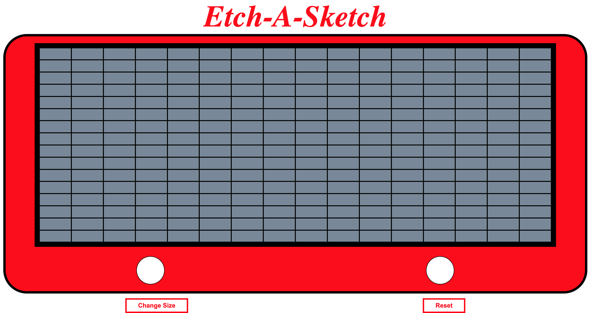

# Etch-A-Sketch
This is my custom version of the childhood game, Etch-A-Sketch. The project is assigned in the 'Foundations' curriculum for The Odin Project, and helped me improve in handling user interaction and DOM manipulation effectively.

## Technologies
This project was created with:
* HTML
* CSS
* Javascript

[Live project on personal website](http://www.joshuaurrea.com/etch-a-sketch)